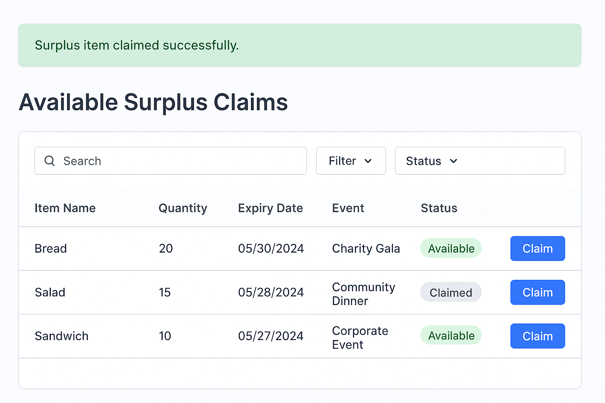
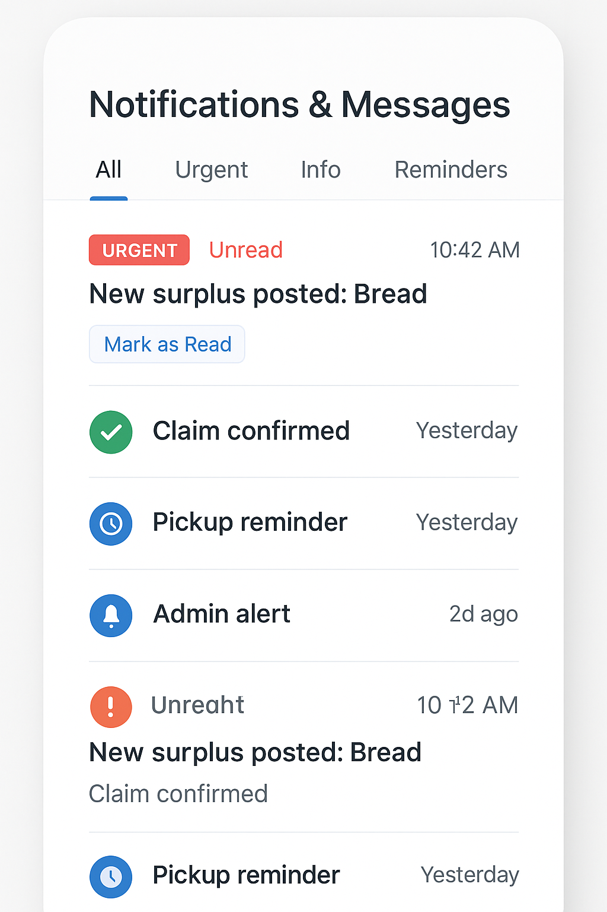
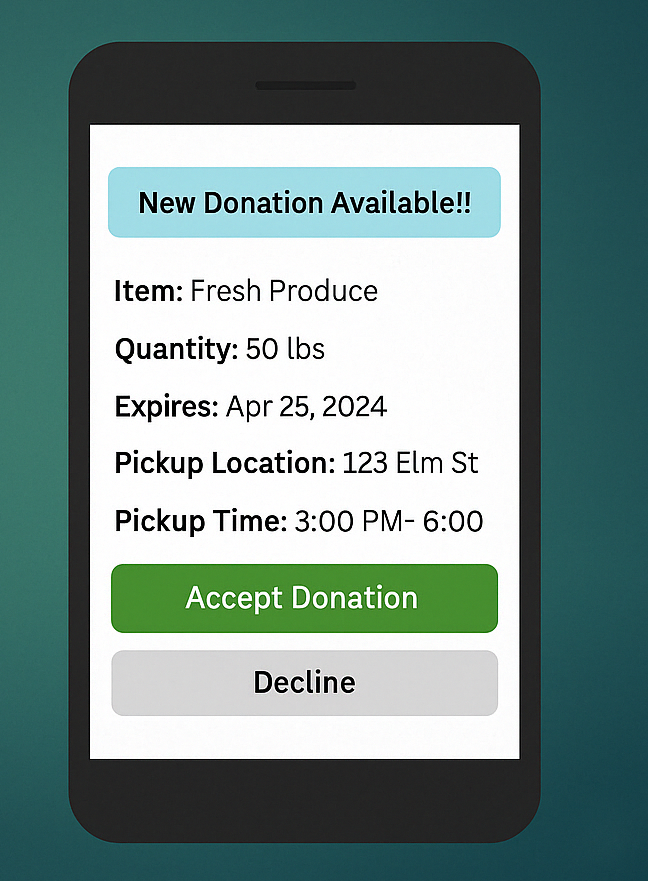

# 🍱 Event Leftover Redistribution System (ELS)

> A smart platform connecting event organizers with charities — automating surplus food donation, real-time tracking, and AI-powered matching to reduce waste and maximize social impact.


---

## 📌 About the Project

Thousands of corporate events, conferences, weddings, and public gatherings generate enormous amounts of surplus food and materials — most of which goes to waste while local food banks and charities struggle with demand.

The **Event Leftover Redistribution System (ELRS)** bridges this gap with an automated, technology-driven platform that lets event organizers instantly post surplus items, intelligently matches them to verified charities, and coordinates pickups — all in real time.

---

## ✨ Core Features

| Feature | Description |
|---|---|
| 📋 **Post Surplus Items** | Event organizers post leftover food/materials with item name, quantity, expiry date, and photo |
| 🤖 **AI-Powered Matching** | Smart algorithm matches surplus with the most suitable charity based on demand history |
| 🔔 **Instant Notifications** | Multi-channel alerts via email, SMS, and push notifications |
| 📦 **Inventory Tracking** | Real-time tracking via AWS DynamoDB — statuses, history, and stock validation |
| 🗺️ **Pickup Coordination** | Charities accept donations and schedule pickups with location and time details |
| 📊 **Admin Reports** | Generate donation history reports and monitor system performance |
| 🔐 **Role-Based Auth** | Secure access control for Event Organizers, Charity Reps, and Admins |

---

## 📱 Application Screenshots

### Login Page


### Main Dashboard


### Admin Dashboard


### Post Surplus Item (Mobile)


### Available Surplus Claims


### Notifications & Messages


### Donation Accept Notification


---

## 🗺️ Use Case Diagram


### Actors

**🏢 Event Organizer**
- Post surplus items
- Attach item details
- Manage donations

**🤝 Charity Representative**
- Accept donations
- Schedule pickups
- View available surplus

**⚙️ System (Automated)**
- Match donations via AI
- Notify charities
- Track inventory
- Generate reports

---

## 🛠️ Technology Stack

- ☁️ **AWS DynamoDB** — Cloud-based real-time inventory management
- 🤖 **AI / ML** — Smart surplus-to-charity matching algorithm
- 📲 **Push / SMS / Email** — Multi-channel notification system
- 🗺️ **Google Maps API** — Pickup location coordination
- 🔐 **Role-Based Access Control** — Secure multi-user authentication
- 📊 **Predictive Analytics** — Demand forecasting for future donations
- 📱 **Mobile UI** — Responsive design for on-the-go use

---

## 🗓️ Project Roadmap

```
Phase 1 — Research & Planning          ✅ Completed
Phase 2 — System Design                ✅ Completed
Phase 3 — Prototype Development        🔄 In Progress
Phase 4 — Refinement & Optimization    🔜 Planned
Phase 5 — Final Review & Presentation  🔜 Planned
```

### Phase Details

**Phase 1: Research & Planning** ✅
Studied manual redistribution inefficiencies, identified key pain points, and evaluated cloud/AI technology options for addressing gaps in the current system.

**Phase 2: System Design** ✅
Designed normalized database schema, UI wireframes, DFDs, ERDs, and multi-channel notification architecture.

**Phase 3: Prototype Development & Testing** 🔄
Building a functional prototype with surplus posting, charity notifications, and inventory tracking. Integration and stress testing currently underway.

**Phase 4: Refinement & Optimization** 🔜
Enhance AI donation matching with machine learning, add real-time stock validation, demand forecasting, and strengthen security protocols.

**Phase 5: Final Review & Presentation** 🔜
Full system demo, stakeholder presentation, performance analysis, and deployment-ready documentation.

---

## 👨‍💻 Team

| Name | Role |
|---|---|
| Mohammed Sajid Ahmed | Backend Developer — database setup, matching logic, notifications |
| Sai Chakravarthy Morla | Frontend Developer — UI for item listings and notifications |
| Sai Venkata Krishna Swamy Nagireddy | QA Tester — system reliability and functionality testing |
| Sanjana Neralwar | Developer & Documentation Specialist — project reports and user guides |
| Pradeep Ponnam | Research Analyst — existing systems research and stakeholder insights |

---

## 📄 License

This project was developed as part of an academic course project. All rights reserved © 2025.

---

> *Reducing food waste, one event at a time.*
